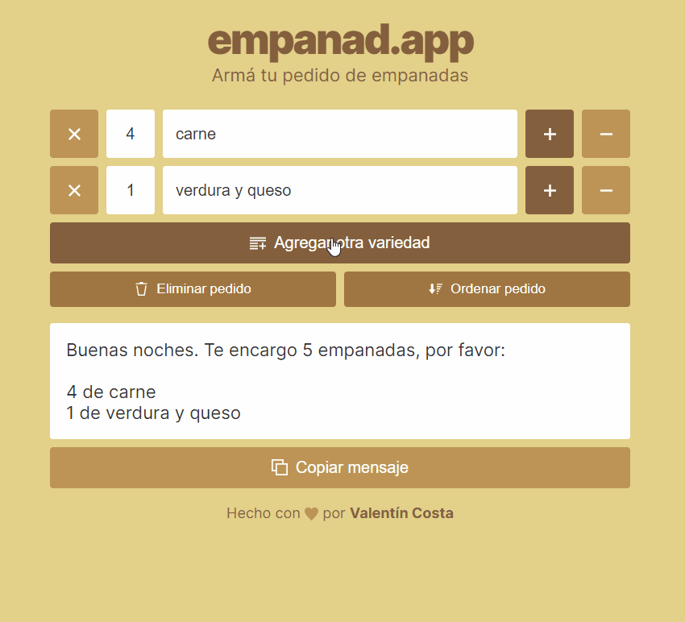

# empanad.app :dumpling:

**Armá tu pedidos de empanadas**

Porque pedir empanadas con amigos debía ser más fácil.

Creado con [Svelte](https://svelte.dev/).

## Uso

1. Agregá todas las variedades y cantidades deseadas.
2. Ordená el pedido por cantidad.
3. Copiá el mensaje con el pedido.
4. Enviaseló a tu lugar de empanadas favorito.

## Contribuir

**¿Tenés una idea, crítica o sugerencia?** Contame [creando un nuevo issue](https://github.com/valentincostam/empanadapp/issues/new).

**¿Querés aportar con código?** Enviá tu pull request. [Acá podés ver cómo.](https://www.freecodecamp.org/espanol/news/como-hacer-tu-primer-pull-request-en-github/)

## Licencia

[MIT](https://choosealicense.com/licenses/mit/) © Valentín Costa